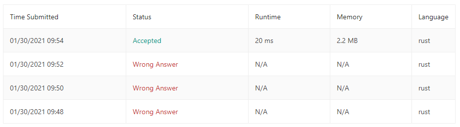

## Problem
[https://leetcode.com/problems/palindrome-number/](https://leetcode.com/problems/palindrome-number/)

## Result
```
Runtime: 20 ms, faster than 7.34% of Rust online submissions for Palindrome Number.
Memory Usage: 2.2 MB, less than 27.41% of Rust online submissions for Palindrome Number.
```

## Notes

Not all the edge cases was considered when developing solution in addition the re-use of reverse number slowed down calculation of result.

