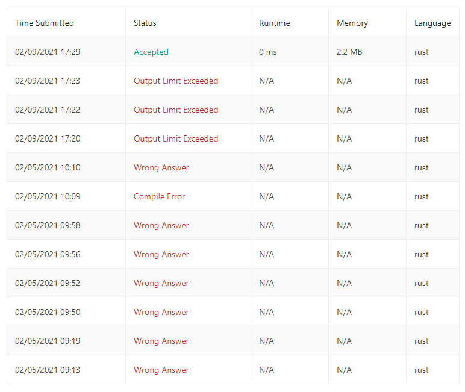

## Problem

[https://leetcode.com/problems/plus-one/](https://leetcode.com/problems/plus-one/)

## Result
Solution two was submitted.

```
Runtime: 0 ms, faster than 100.00% of Rust online submissions for Plus One.
Memory Usage: 2.2 MB, less than 6.67% of Rust online submissions for Plus One.
```

## Notes

Not all the edge cases was considered when developing solution in addition the initial solution was making the problem more complex by trying to convert array to a number and then incrementing instead just sticking with the array.

Sometimes we just overthink it, note to self keep it simple.

