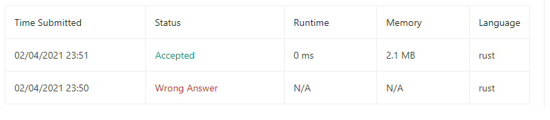

## Problem

[https://leetcode.com/problems/valid-parentheses/](https://leetcode.com/problems/valid-parentheses/)

## Result

```
Runtime: 0 ms, faster than 100.00% of Rust online submissions for Valid Parentheses.
Memory Usage: 2.1 MB, less than 32.10% of Rust online submissions for Valid Parentheses.
```

## Notes

Missing if statement to check if stack is empty was forgotten leading to another submission.

In addition, initial reading of problem was misunderstood as how the valid nested patterns look. I had to read solution to fully understand the problem at hand. Afterwards implementation was developed on it own.

